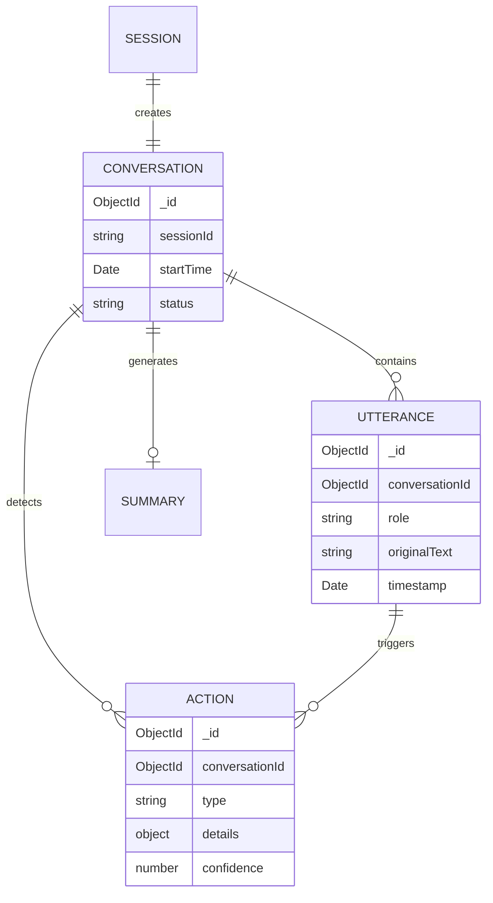

# Database Schema Design

## 🗄️ MongoDB Collections

### Overview
Using MongoDB with native driver (no ORM) for flexible schema evolution and efficient storage of conversation data. All data validation is handled by Zod schemas at the application layer.

## 🏗️ Data Layer Architecture

### Key Principles
1. **No ORM**: Direct MongoDB driver usage for full control
2. **Zod Validation**: Type-safe validation for all data in/out of DB
3. **Repository Pattern**: Database operations isolated in repositories
4. **Service Layer**: Business logic separated from data access
5. **Dependency Injection**: Easy to swap implementations

### Layer Responsibilities

```
Controller → Service → Repository → MongoDB
    ↓           ↓           ↓
   Zod       Business    Database
 Validation    Logic     Operations
```

## 📊 Collections

### 1. `conversations`
Stores complete conversation sessions between clinicians and patients.

```typescript
interface Conversation {
  _id: ObjectId;
  sessionId: string;                    // OpenAI session ID
  
  // Participants
  clinicianId?: string;                 // Future: auth integration
  patientId?: string;                   // Optional patient record
  
  // Timing
  startTime: Date;
  endTime?: Date;
  duration?: number;                    // Seconds
  
  // Status
  status: 'active' | 'completed' | 'error';
  errorDetails?: {
    code: string;
    message: string;
    timestamp: Date;
  };
  
  // Content
  language: {
    primary: 'en' | 'es';               // Clinician language
    secondary: 'en' | 'es';             // Patient language
  };
  
  // Metadata
  metadata: {
    location?: string;                  // Clinic/hospital
    visitType?: string;                 // Routine/urgent/emergency
    department?: string;                // Cardiology, etc.
  };
  
  // Computed fields
  utteranceCount: number;
  actionCount: number;
  
  // Timestamps
  createdAt: Date;
  updatedAt: Date;
}

// Indexes
{
  sessionId: 1,        // Unique lookup
  clinicianId: 1,      // Query by clinician
  startTime: -1,       // Recent first
  status: 1            // Filter active
}
```

### 2. `utterances`
Individual spoken segments within a conversation.

```typescript
interface Utterance {
  _id: ObjectId;
  conversationId: ObjectId;             // Reference to conversation
  
  // Speaker info
  role: 'clinician' | 'patient' | 'assistant' | 'family';
  speakerId?: string;                   // For multi-party conversations
  
  // Content
  originalLanguage: 'en' | 'es';
  originalText: string;
  translatedText?: string;
  
  // Audio reference
  audioData?: {
    url?: string;                       // S3/storage URL
    duration: number;                   // Seconds
    format: 'pcm16' | 'mp3';
  };
  
  // Quality metrics
  confidence: {
    transcription: number;              // 0-1 Whisper confidence
    translation: number;                // 0-1 Translation confidence
  };
  
  // Medical content
  medicalTerms?: Array<{
    term: string;
    category: 'medication' | 'procedure' | 'condition' | 'anatomy';
    confidence: number;
    icd10?: string[];
    rxnorm?: string;
  }>;
  
  // Flags
  flags: {
    isRepeatRequest?: boolean;          // "Can you repeat that?"
    containsPHI?: boolean;              // Has personal info
    needsReview?: boolean;              // Low confidence
  };
  
  // Timing
  timestamp: Date;
  sequenceNumber: number;               // Order in conversation
}

// Indexes
{
  conversationId: 1,
  timestamp: 1,
  sequenceNumber: 1,
  'medicalTerms.term': 'text'         // Text search
}
```

### 3. `actions`
Detected medical actions requiring follow-up.

```typescript
interface Action {
  _id: ObjectId;
  conversationId: ObjectId;
  utteranceId: ObjectId;                // Source utterance
  
  // Action details
  type: 'lab_order' | 'prescription' | 'referral' | 'follow_up' | 
        'diagnostic_test' | 'vaccination' | 'procedure';
  
  category: 'routine' | 'urgent' | 'stat';
  
  details: {
    // For prescriptions
    medication?: {
      name: string;
      dosage?: string;
      frequency?: string;
      duration?: string;
      rxnormCode?: string;
    };
    
    // For lab orders
    labTest?: {
      name: string;
      loincCode?: string;
      urgency?: string;
    };
    
    // For referrals
    referral?: {
      specialty: string;
      reason: string;
      urgency: string;
    };
    
    // For follow-up
    followUp?: {
      timeframe: string;                // "2 weeks", "3 months"
      reason: string;
    };
  };
  
  // Confidence & validation
  confidence: number;                   // 0-1 detection confidence
  validated: boolean;                   // Clinician confirmed
  validatedBy?: string;
  validatedAt?: Date;
  
  // Webhook execution
  webhook?: {
    url: string;
    status: 'pending' | 'sent' | 'failed' | 'acknowledged';
    attempts: number;
    lastAttempt?: Date;
    response?: any;
    error?: string;
  };
  
  // Medical codes
  codes?: {
    icd10?: string[];                   // Diagnosis codes
    cpt?: string[];                     // Procedure codes
  };
  
  // Timestamps
  detectedAt: Date;
  executedAt?: Date;
}

// Indexes
{
  conversationId: 1,
  type: 1,
  'webhook.status': 1,
  detectedAt: -1
}
```

### 4. `summaries`
AI-generated clinical summaries.

```typescript
interface Summary {
  _id: ObjectId;
  conversationId: ObjectId;
  
  // Summary content
  content: {
    chiefComplaint: string;
    historyOfPresentIllness: string;
    assessmentAndPlan: string;
    medicationsDiscussed: string[];
    testsOrdered: string[];
    followUpInstructions: string;
  };
  
  // Structured data
  extractedData: {
    symptoms: Array<{
      name: string;
      duration?: string;
      severity?: string;
    }>;
    
    vitalSigns?: {
      bloodPressure?: string;
      heartRate?: string;
      temperature?: string;
      weight?: string;
    };
    
    diagnoses: Array<{
      description: string;
      icd10Code?: string;
      confidence: number;
    }>;
  };
  
  // Generation metadata
  generatedBy: 'automatic' | 'manual';
  model: string;                        // GPT model used
  prompt?: string;                      // For debugging
  
  // Review status
  reviewStatus: 'pending' | 'approved' | 'edited';
  reviewedBy?: string;
  reviewNotes?: string;
  
  // Timestamps
  generatedAt: Date;
  reviewedAt?: Date;
}

// Indexes
{
  conversationId: 1,
  reviewStatus: 1,
  generatedAt: -1
}
```

### 5. `sessions`
Ephemeral token management (optional).

```typescript
interface Session {
  _id: ObjectId;
  token: string;                        // Ephemeral token
  openaiSessionId: string;              // OpenAI session
  
  // Configuration used
  config: {
    model: string;
    voice: string;
    instructions: string;
    temperature: number;
  };
  
  // Lifecycle
  createdAt: Date;
  expiresAt: Date;                      // createdAt + 60s
  used: boolean;
  usedAt?: Date;
  
  // Request info
  requestIp?: string;
  userAgent?: string;
}

// Indexes
{
  token: 1,                             // Unique
  expiresAt: 1,                         // TTL index
  used: 1
}
```

## 🔄 Relationships



## 🔐 Zod Schemas & Validation

### Conversation Schemas

```typescript
// lib/schemas/conversation.schema.ts
import { z } from 'zod';
import { ObjectId } from 'mongodb';

// Base schema for creation (no _id)
export const conversationCreateSchema = z.object({
  sessionId: z.string().min(1),
  clinicianId: z.string().optional(),
  patientId: z.string().optional(),
  startTime: z.date(),
  status: z.literal('active'),
  language: z.object({
    primary: z.enum(['en', 'es']),
    secondary: z.enum(['en', 'es'])
  }),
  metadata: z.object({
    location: z.string().optional(),
    visitType: z.string().optional(),
    department: z.string().optional()
  }).optional(),
  utteranceCount: z.number().default(0),
  actionCount: z.number().default(0),
  createdAt: z.date().default(() => new Date()),
  updatedAt: z.date().default(() => new Date())
});

// Schema for updates
export const conversationUpdateSchema = conversationCreateSchema.partial().extend({
  endTime: z.date().optional(),
  duration: z.number().optional(),
  status: z.enum(['active', 'completed', 'error']).optional(),
  errorDetails: z.object({
    code: z.string(),
    message: z.string(),
    timestamp: z.date()
  }).optional()
});

// Schema for database documents (includes _id)
export const conversationDocumentSchema = conversationCreateSchema.extend({
  _id: z.instanceof(ObjectId)
});

// Type exports
export type ConversationCreate = z.infer<typeof conversationCreateSchema>;
export type ConversationUpdate = z.infer<typeof conversationUpdateSchema>;
export type ConversationDocument = z.infer<typeof conversationDocumentSchema>;
```

### Utterance Schemas

```typescript
// lib/schemas/utterance.schema.ts
export const utteranceCreateSchema = z.object({
  conversationId: z.instanceof(ObjectId),
  role: z.enum(['clinician', 'patient', 'assistant', 'family']),
  speakerId: z.string().optional(),
  originalLanguage: z.enum(['en', 'es']),
  originalText: z.string().min(1),
  translatedText: z.string().optional(),
  audioData: z.object({
    url: z.string().url().optional(),
    duration: z.number().positive(),
    format: z.enum(['pcm16', 'mp3'])
  }).optional(),
  confidence: z.object({
    transcription: z.number().min(0).max(1),
    translation: z.number().min(0).max(1)
  }),
  medicalTerms: z.array(z.object({
    term: z.string(),
    category: z.enum(['medication', 'procedure', 'condition', 'anatomy']),
    confidence: z.number().min(0).max(1),
    icd10: z.array(z.string()).optional(),
    rxnorm: z.string().optional()
  })).optional(),
  flags: z.object({
    isRepeatRequest: z.boolean().optional(),
    containsPHI: z.boolean().optional(),
    needsReview: z.boolean().optional()
  }).default({}),
  timestamp: z.date(),
  sequenceNumber: z.number().int().positive()
});
```

## 🏛️ Repository Pattern Implementation

### Base Repository

```typescript
// lib/server/repositories/base.repository.ts
import { Collection, Db, Filter, OptionalId, WithId } from 'mongodb';
import { z } from 'zod';

export interface IRepository<T> {
  create(data: OptionalId<T>): Promise<WithId<T>>;
  findById(id: string): Promise<WithId<T> | null>;
  findOne(filter: Filter<T>): Promise<WithId<T> | null>;
  findMany(filter?: Filter<T>): Promise<WithId<T>[]>;
  update(id: string, data: Partial<T>): Promise<boolean>;
  delete(id: string): Promise<boolean>;
}

export abstract class BaseRepository<T> implements IRepository<T> {
  protected collection: Collection<T>;
  
  constructor(
    protected db: Db,
    protected collectionName: string,
    protected createSchema: z.ZodSchema,
    protected updateSchema: z.ZodSchema
  ) {
    this.collection = db.collection<T>(collectionName);
  }
  
  async create(data: OptionalId<T>): Promise<WithId<T>> {
    // Validate with Zod
    const validated = this.createSchema.parse(data);
    
    // Insert into MongoDB
    const result = await this.collection.insertOne(validated);
    
    // Return with _id
    return {
      ...validated,
      _id: result.insertedId
    } as WithId<T>;
  }
  
  async findById(id: string): Promise<WithId<T> | null> {
    try {
      const objectId = new ObjectId(id);
      return await this.collection.findOne({ _id: objectId } as Filter<T>);
    } catch {
      return null; // Invalid ObjectId
    }
  }
  
  async findOne(filter: Filter<T>): Promise<WithId<T> | null> {
    return await this.collection.findOne(filter);
  }
  
  async findMany(filter: Filter<T> = {}): Promise<WithId<T>[]> {
    return await this.collection.find(filter).toArray();
  }
  
  async update(id: string, data: Partial<T>): Promise<boolean> {
    // Validate update data
    const validated = this.updateSchema.parse(data);
    
    // Add updatedAt timestamp
    const updateData = {
      ...validated,
      updatedAt: new Date()
    };
    
    const result = await this.collection.updateOne(
      { _id: new ObjectId(id) } as Filter<T>,
      { $set: updateData }
    );
    
    return result.modifiedCount > 0;
  }
  
  async delete(id: string): Promise<boolean> {
    const result = await this.collection.deleteOne(
      { _id: new ObjectId(id) } as Filter<T>
    );
    
    return result.deletedCount > 0;
  }
}
```

### Conversation Repository

```typescript
// lib/server/repositories/conversation.repository.ts
import { Db, ObjectId } from 'mongodb';
import { BaseRepository } from './base.repository';
import { 
  ConversationDocument,
  conversationCreateSchema,
  conversationUpdateSchema 
} from '@/lib/schemas/conversation.schema';

export interface IConversationRepository extends IRepository<ConversationDocument> {
  findActive(): Promise<ConversationDocument[]>;
  findByClinicianId(clinicianId: string): Promise<ConversationDocument[]>;
  endConversation(id: string): Promise<boolean>;
}

export class ConversationRepository 
  extends BaseRepository<ConversationDocument> 
  implements IConversationRepository {
  
  constructor(db: Db) {
    super(
      db, 
      'conversations', 
      conversationCreateSchema,
      conversationUpdateSchema
    );
  }
  
  async findActive(): Promise<ConversationDocument[]> {
    return this.findMany({ status: 'active' });
  }
  
  async findByClinicianId(clinicianId: string): Promise<ConversationDocument[]> {
    return this.findMany({ clinicianId });
  }
  
  async endConversation(id: string): Promise<boolean> {
    const endTime = new Date();
    const conversation = await this.findById(id);
    
    if (!conversation) return false;
    
    const duration = Math.floor(
      (endTime.getTime() - conversation.startTime.getTime()) / 1000
    );
    
    return this.update(id, {
      status: 'completed',
      endTime,
      duration
    });
  }
}
```

## 💼 Service Layer Pattern

### Base Service

```typescript
// lib/server/services/base.service.ts
import { WithId } from 'mongodb';

export interface IService<T> {
  create(data: Omit<T, '_id'>): Promise<WithId<T>>;
  findById(id: string): Promise<WithId<T> | null>;
  update(id: string, data: Partial<T>): Promise<WithId<T> | null>;
  delete(id: string): Promise<boolean>;
}

export abstract class BaseService<T> implements IService<T> {
  constructor(protected repository: IRepository<T>) {}
  
  async create(data: Omit<T, '_id'>): Promise<WithId<T>> {
    // Business logic can go here
    return this.repository.create(data);
  }
  
  async findById(id: string): Promise<WithId<T> | null> {
    return this.repository.findById(id);
  }
  
  async update(id: string, data: Partial<T>): Promise<WithId<T> | null> {
    const success = await this.repository.update(id, data);
    if (success) {
      return this.repository.findById(id);
    }
    return null;
  }
  
  async delete(id: string): Promise<boolean> {
    return this.repository.delete(id);
  }
}
```

### Conversation Service

```typescript
// lib/server/services/conversation.service.ts
import { WithId } from 'mongodb';
import { BaseService } from './base.service';
import { IConversationRepository } from '@/lib/server/repositories/conversation.repository';
import { ConversationDocument } from '@/lib/schemas/conversation.schema';
import { IUtteranceRepository } from '@/lib/server/repositories/utterance.repository';
import { IActionDetector } from '@/lib/server/actions/detector';
import { ISummaryGenerator } from '@/lib/server/summaries/generator';

export interface ConversationEndResult {
  conversation: WithId<ConversationDocument>;
  summary?: any;
  detectedActions: any[];
}

export interface IConversationService extends IService<ConversationDocument> {
  findActive(): Promise<WithId<ConversationDocument>[]>;
  endConversation(id: string, options?: { generateSummary?: boolean }): Promise<ConversationEndResult>;
}

export class ConversationService 
  extends BaseService<ConversationDocument> 
  implements IConversationService {
  
  constructor(
    protected repository: IConversationRepository,
    private utteranceRepository: IUtteranceRepository,
    private actionDetector: IActionDetector,
    private summaryGenerator: ISummaryGenerator
  ) {
    super(repository);
  }
  
  async findActive(): Promise<WithId<ConversationDocument>[]> {
    return this.repository.findActive();
  }
  
  async endConversation(
    id: string, 
    options?: { generateSummary?: boolean }
  ): Promise<ConversationEndResult> {
    // Business logic for ending conversation
    const conversation = await this.repository.findById(id);
    if (!conversation) {
      throw new Error('Conversation not found');
    }
    
    if (conversation.status !== 'active') {
      throw new Error('Conversation already ended');
    }
    
    // End the conversation
    await this.repository.endConversation(id);
    
    // Get all utterances for final processing
    const utterances = await this.utteranceRepository.findByConversationId(id);
    
    // Detect any remaining actions
    const detectedActions = [];
    for (const utterance of utterances) {
      const actions = await this.actionDetector.detectActions(
        utterance.originalText,
        { conversationId: id, utteranceId: utterance._id.toString() }
      );
      detectedActions.push(...actions);
    }
    
    // Generate summary if requested
    let summary;
    if (options?.generateSummary) {
      summary = await this.summaryGenerator.generateSummary(id);
    }
    
    // Return updated conversation
    const updatedConversation = await this.repository.findById(id);
    if (!updatedConversation) {
      throw new Error('Failed to retrieve updated conversation');
    }
    
    return {
      conversation: updatedConversation,
      summary,
      detectedActions
    };
  }
}
```

## 💉 Dependency Injection

### Container Setup

```typescript
// lib/server/container.ts
import { Db } from 'mongodb';
import { getDb } from './db';

// Repositories
import { ConversationRepository } from './repositories/conversation.repository';
import { UtteranceRepository } from './repositories/utterance.repository';
import { ActionRepository } from './repositories/action.repository';
import { SummaryRepository } from './repositories/summary.repository';

// Services
import { ConversationService } from './services/conversation.service';
import { UtteranceService } from './services/utterance.service';
import { ActionService } from './services/action.service';

// Domain services
import { ActionDetector } from './actions/detector';
import { SummaryGenerator } from './summaries/generator';
import { WebhookExecutor } from './webhooks/executor';

export class Container {
  private static instance: Container;
  private db: Db;
  
  // Repository instances
  private conversationRepo?: ConversationRepository;
  private utteranceRepo?: UtteranceRepository;
  private actionRepo?: ActionRepository;
  private summaryRepo?: SummaryRepository;
  
  // Service instances
  private conversationSvc?: ConversationService;
  private utteranceSvc?: UtteranceService;
  private actionSvc?: ActionService;
  
  // Domain service instances
  private actionDetector?: ActionDetector;
  private summaryGenerator?: SummaryGenerator;
  private webhookExecutor?: WebhookExecutor;
  
  private constructor() {
    this.db = getDb();
  }
  
  static getInstance(): Container {
    if (!Container.instance) {
      Container.instance = new Container();
    }
    return Container.instance;
  }
  
  // Repository getters (lazy initialization)
  get conversationRepository(): ConversationRepository {
    if (!this.conversationRepo) {
      this.conversationRepo = new ConversationRepository(this.db);
    }
    return this.conversationRepo;
  }
  
  get utteranceRepository(): UtteranceRepository {
    if (!this.utteranceRepo) {
      this.utteranceRepo = new UtteranceRepository(this.db);
    }
    return this.utteranceRepo;
  }
  
  get actionRepository(): ActionRepository {
    if (!this.actionRepo) {
      this.actionRepo = new ActionRepository(this.db);
    }
    return this.actionRepo;
  }
  
  // Service getters
  get conversationService(): ConversationService {
    if (!this.conversationSvc) {
      this.conversationSvc = new ConversationService(
        this.conversationRepository,
        this.utteranceRepository,
        this.getActionDetector(),
        this.getSummaryGenerator()
      );
    }
    return this.conversationSvc;
  }
  
  get utteranceService(): UtteranceService {
    if (!this.utteranceSvc) {
      this.utteranceSvc = new UtteranceService(
        this.utteranceRepository,
        this.conversationRepository
      );
    }
    return this.utteranceSvc;
  }
  
  // Domain services
  private getActionDetector(): ActionDetector {
    if (!this.actionDetector) {
      this.actionDetector = new ActionDetector();
    }
    return this.actionDetector;
  }
  
  private getSummaryGenerator(): SummaryGenerator {
    if (!this.summaryGenerator) {
      this.summaryGenerator = new SummaryGenerator(
        this.utteranceRepository,
        this.actionRepository
      );
    }
    return this.summaryGenerator;
  }
  
  // For testing - allow injection of mocks
  setConversationRepository(repo: ConversationRepository): void {
    this.conversationRepo = repo;
  }
  
  setUtteranceRepository(repo: UtteranceRepository): void {
    this.utteranceRepo = repo;
  }
}

// Export singleton getter
export const getContainer = () => Container.getInstance();
```

### Usage in API Routes

```typescript
// app/api/conversations/route.ts
import { NextRequest, NextResponse } from 'next/server';
import { getContainer } from '@/lib/server/container';
import { conversationCreateSchema } from '@/lib/schemas/conversation.schema';

export async function POST(request: NextRequest) {
  try {
    const container = getContainer();
    const conversationService = container.conversationService;
    
    // Parse and validate request body
    const body = await request.json();
    const validatedData = conversationCreateSchema.parse(body);
    
    // Create conversation using service
    const conversation = await conversationService.create(validatedData);
    
    return NextResponse.json({
      success: true,
      data: conversation
    });
    
  } catch (error) {
    if (error instanceof z.ZodError) {
      return NextResponse.json(
        { 
          success: false, 
          error: 'Validation failed',
          details: error.errors 
        },
        { status: 400 }
      );
    }
    
    console.error('Failed to create conversation:', error);
    return NextResponse.json(
      { success: false, error: 'Internal server error' },
      { status: 500 }
    );
  }
}

export async function GET(request: NextRequest) {
  try {
    const container = getContainer();
    const conversationService = container.conversationService;
    
    // Get active conversations
    const conversations = await conversationService.findActive();
    
    return NextResponse.json({
      success: true,
      data: conversations,
      meta: {
        total: conversations.length
      }
    });
    
  } catch (error) {
    console.error('Failed to fetch conversations:', error);
    return NextResponse.json(
      { success: false, error: 'Internal server error' },
      { status: 500 }
    );
  }
}
```

## 🚀 Migration Strategy

### Phase 1: MVP
```javascript
// Start with simple schema
db.conversations.insertOne({
  sessionId: "abc123",
  startTime: new Date(),
  status: "active",
  utterances: []  // Embedded for MVP
});
```

### Phase 2: Scale
```javascript
// Move to references
db.utterances.insertOne({
  conversationId: ObjectId("..."),
  text: "Patient presents with...",
  timestamp: new Date()
});
```

## 📈 Performance Considerations

### 1. Indexes
- Create indexes based on query patterns
- Compound indexes for common filters
- Text indexes for search

### 2. Sharding Keys (Future)
```javascript
// Potential sharding strategy
sh.shardCollection("medical.conversations", { 
  clinicianId: 1, 
  startTime: 1 
});
```

### 3. Data Retention
```javascript
// Archive old conversations
db.conversations.createIndex(
  { "endTime": 1 },
  { expireAfterSeconds: 7 * 365 * 24 * 60 * 60 }  // 7 years for HIPAA
);
```

## 🔒 Security Considerations

1. **Encryption at Rest**: Enable MongoDB encryption
2. **Field-Level Encryption**: For PII/PHI fields
3. **Audit Logging**: Track all data access
4. **Access Control**: Role-based permissions

```javascript
// Example: Encrypted fields
{
  patientName: {
    $encrypt: {
      value: "John Doe",
      algorithm: "AEAD_AES_256_CBC_HMAC_SHA_512"
    }
  }
}
```