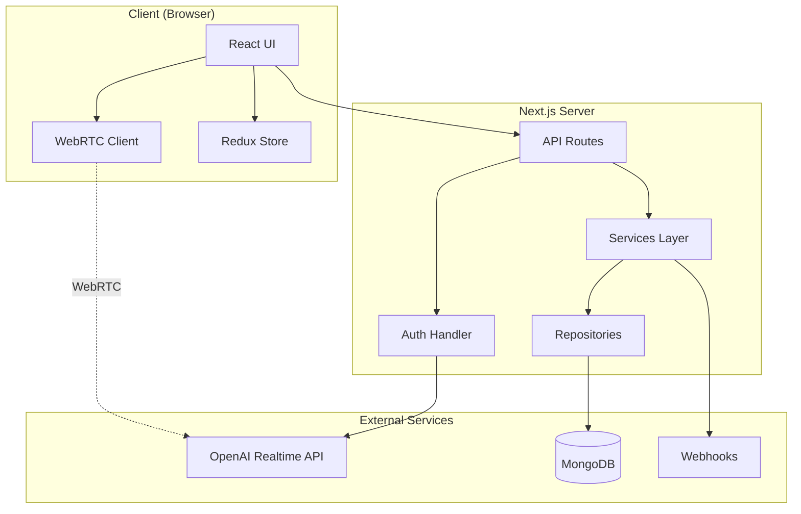

# System Architecture Overview

## 🏗️ High-Level Architecture



## 🔄 Data Flow

### 1. Voice Conversation Flow
```
User Speaks → Microphone → WebRTC → OpenAI → Translation → WebRTC → Speaker → User Hears
     ↓                                              ↓
  [Store in Redux]                          [Detect Actions]
     ↓                                              ↓
  [Display Text]                            [Trigger Webhooks]
```

### 2. Session Lifecycle
```
1. User clicks "Start"
2. Frontend requests ephemeral token from /api/session
3. Server creates session via OpenAI API
4. Server returns token to frontend
5. Frontend establishes WebRTC connection
6. Conversation proceeds in real-time
7. On end, frontend sends transcript to server
8. Server stores conversation & triggers actions
```

## 🌐 External Services Layer

All external services are abstracted behind interfaces for flexibility and testability:

```
Business Logic → Interface → Provider → External API
                     ↑
                  Can swap
                 providers
```

### Key External Services
- **AI Service**: OpenAI, Anthropic, etc.
- **Storage Service**: S3, Local, Memory
- **Email Service**: SendGrid, SES, SMTP
- **Webhook Service**: HTTP client with retries
- **Analytics Service**: Mixpanel, Amplitude, etc.

### Benefits
1. **Provider Agnostic**: Switch providers via config
2. **Testable**: Easy to mock in tests
3. **Type Safe**: Interfaces define contracts
4. **Future Proof**: Add new providers without changing business logic

## 🏛️ Component Architecture

### Frontend Components
```
src/
├── app/
│   ├── page.tsx                    # Home page
│   ├── interpreter/
│   │   └── page.tsx               # Main interpreter UI
│   └── layout.tsx                 # Root layout
├── components/
│   ├── VoiceChat/                 # Core voice component
│   │   ├── index.tsx              # Main component
│   │   ├── WebRTCClient.ts        # WebRTC logic
│   │   └── AudioVisualizer.tsx    # Waveform display
│   ├── TranscriptDisplay/         # Show conversation
│   ├── ActionsSummary/            # Medical actions
│   └── LanguageToggle/            # EN/ES switch
```

### Backend Architecture
```
src/
├── lib/
│   ├── server/
│   │   ├── db.ts                  # MongoDB connection
│   │   ├── repositories/
│   │   │   ├── base.repository.ts
│   │   │   └── conversation.repository.ts
│   │   ├── services/
│   │   │   ├── base.service.ts
│   │   │   ├── conversation.service.ts
│   │   │   └── openai.service.ts
│   │   └── actions/
│   │       ├── detector.ts        # Action detection
│   │       └── webhook.ts         # Webhook execution
│   └── client/
│       ├── webrtc/
│       └── hooks/
```

## 🔐 Security Architecture

### API Security
```typescript
// All API routes follow this pattern
export async function POST(request: Request) {
  // 1. Authentication (future)
  const session = await getSession(request);
  
  // 2. Validation
  const body = validateRequest(await request.json());
  
  // 3. Authorization (future)
  if (!canAccess(session, body.resource)) {
    return unauthorized();
  }
  
  // 4. Process
  const result = await service.process(body);
  
  // 5. Audit (future)
  await auditLog(session, 'action', result);
  
  return NextResponse.json(result);
}
```

### Token Flow
```
Never expose OpenAI API key to client!

[Client] → [Request Token] → [Server]
                                 ↓
                          [Validate Request]
                                 ↓
                          [OpenAI API Key]
                                 ↓
                          [Create Session]
                                 ↓
[Client] ← [Ephemeral Token] ← [Server]
   ↓
[Direct WebRTC to OpenAI]
```

## 🔌 Integration Points

### 1. OpenAI Realtime API
- **Protocol**: WebRTC
- **Auth**: Ephemeral tokens (60s TTL)
- **Models**: gpt-4o-realtime-preview
- **Features**: VAD, transcription, function calling

### 2. MongoDB
- **Connection**: Singleton pattern
- **ODM**: Prisma (planned) or native driver
- **Collections**: conversations, actions, sessions

### 3. Webhooks
- **Trigger**: Medical action detection
- **Payload**: Action type, details, confidence
- **Retry**: Exponential backoff
- **Timeout**: 30 seconds

## 🚀 Deployment Architecture

### Development
```
Local Next.js → Local MongoDB → OpenAI API
```

### Production (Planned)
```
Vercel/GCP → MongoDB Atlas → OpenAI API
     ↓
   CDN
     ↓
  Users
```

### Scaling Considerations
1. **WebRTC**: Each conversation is P2P with OpenAI
2. **Database**: MongoDB can scale horizontally
3. **API**: Serverless functions auto-scale
4. **State**: Redis for session state (future)

## 📊 Performance Architecture

### Optimization Points
1. **WebRTC**: Direct connection for lowest latency
2. **Audio**: 16kHz PCM16 for quality/size balance
3. **Caching**: Ephemeral tokens cached 50s
4. **Database**: Indexed on conversationId, timestamp

### Monitoring (Future)
```typescript
// Performance tracking
export function trackMetric(metric: string, value: number) {
  // Send to monitoring service
  telemetry.record({
    metric,
    value,
    timestamp: Date.now(),
    session: getSessionId()
  });
}

// Usage
trackMetric('webrtc.connection.time', connectionTime);
trackMetric('translation.latency', latency);
```