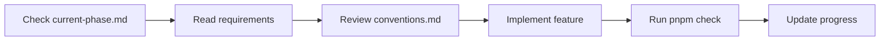

# AI Assistant Guide - Medical Language Interpreter

Welcome! This directory contains all AI-specific documentation for efficient development assistance.

## 🚀 Quick Start

1. **New to the project?** → Start with [`context.md`](./context.md)
2. **Ready to code?** → Check [`phases/current-phase.md`](./phases/current-phase.md) 
3. **Writing code?** → Follow [`conventions.md`](./conventions.md)
4. **Need examples?** → Browse [`examples/`](./examples/)

## 📁 Directory Structure

```
.ai/
├── context.md               # Project overview & current state
├── conventions.md           # Coding standards & patterns
├── architecture/           # Technical design docs
│   ├── overview.md         # System architecture
│   ├── database-schema.md  # MongoDB collections
│   ├── api-design.md       # API patterns & endpoints  
│   ├── tech-stack.md       # Technology choices
│   └── external-services.md # External service abstraction
├── phases/                 # Development phases
│   ├── 01-mvp-voice.md     # Basic WebRTC setup
│   ├── 02-translation.md   # Add translation features
│   ├── 03-medical.md       # Medical-specific features
│   └── current-phase.md    # → Links to active phase
├── examples/               # Code examples
│   ├── code-patterns.md    # Common patterns
│   └── api-responses.md    # Data structures
└── prompts/               # Tested AI prompts
    ├── tested/            # Proven prompts
    └── templates/         # Prompt templates
```

## 🎯 How to Use These Docs

### For Feature Development
1. Check `phases/current-phase.md` for current goals
2. Reference `architecture/` for technical context
3. Follow patterns in `conventions.md`
4. Use `examples/` for implementation guidance

### For Debugging
1. Check `context.md` for known issues
2. Review `architecture/overview.md` for system flow
3. Use tested prompts from `prompts/tested/`

## 🔄 Development Workflow



## 📋 Key Commands

```bash
# Always available
pnpm install          # Install dependencies
pnpm dev             # Start development server
pnpm check           # Run TypeScript & linting checks
pnpm build           # Build for production

# Current phase specific - check phases/current-phase.md
```

## 🔗 Important Links

- **Main Instructions**: [`/CLAUDE.md`](../CLAUDE.md) - Primary AI instructions
- **Human Docs**: [`/docs/`](../docs/) - User-facing documentation
- **Source Code**: [`/src/`](../src/) - Implementation